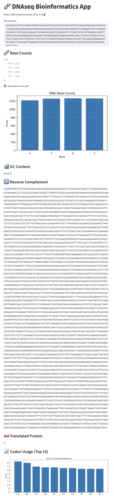

# 🧬 DNAseq Toolbox

A Python bioinformatics playground to analyse DNA sequences and gene expression — built for learning, experimenting, and having fun while coding with biology.

---

## ✨ Features

- 🧬 Count DNA bases (A, T, G, C)
- 📊 Plot base frequency as a bar chart
- 🔁 Get reverse complement of DNA
- 📈 GC content analysis (overall and sliding window)
- 🧫 Translate DNA to protein with codon logic
- 🧬 Visualise gene expression from `.csv` using `pandas`

---

## 🧪 Sample DNA Sequence

```
dna = "ATGGCCATTGTAATGGGCCGCTGAAAGGGTGCCCGATAG"
```
---
## 📊 Sample Gene Expression Data
Gene,Expression
```
TP53,5.2
BRCA1,3.8
MYC,7.1
EGFR,6.3
ACTB,4.5
```
---

## 📁 Project Structure
DNAseq/
├── dna_utils.py              # All reusable DNA/gene functions
├── plot.py                   # Run your main analysis here
├── requirements.txt          # Packages to install
├── README.md                 # Project overview (you're reading it!)
└── data/
    └── gene_expression.csv   # Expression data for plotting
---

## 🚀 How to Run
1. Clone this repo
2. Create a virtual environment (optional but recommended)
3. Install dependencies: ``pip install -r requirements.txt
``
4. Run the main script: ``python plot.py``

---
## 📸 Outputs
- ✅ Base counts + GC content in terminal

- ✅ Reverse complement + protein string

- 📊 Base frequency bar chart

- 📈 GC content sliding window plot

- 🧬 Gene expression bar chart using pandas

---


**Let me know when it's pasted and committed — and if you want to add emojis, badges, or screenshots next! 🧬💖**

---

## 🖼️ Preview



